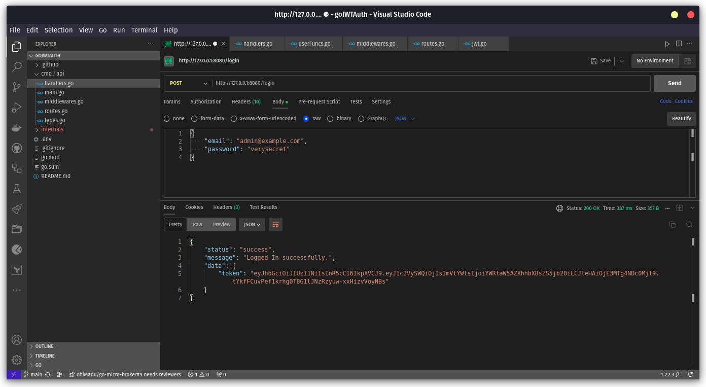
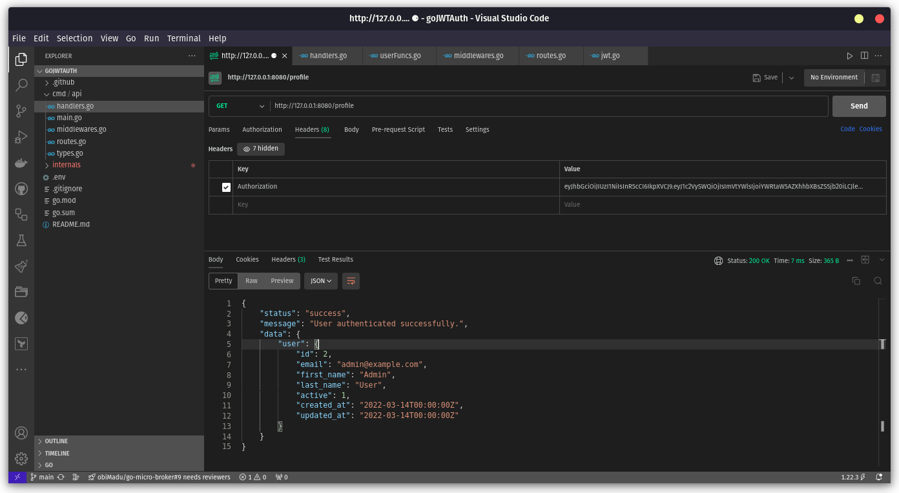

# It's nothing much, lol.

Just me learning to build out a JWT-based auth workflow in Go. I succeeded, lol.

- Calling the /login endpoint with credentials, getting a token back.
  - 

- Calling the protected /profile endpoint a token header, getting through.
  - 

Good stuff.